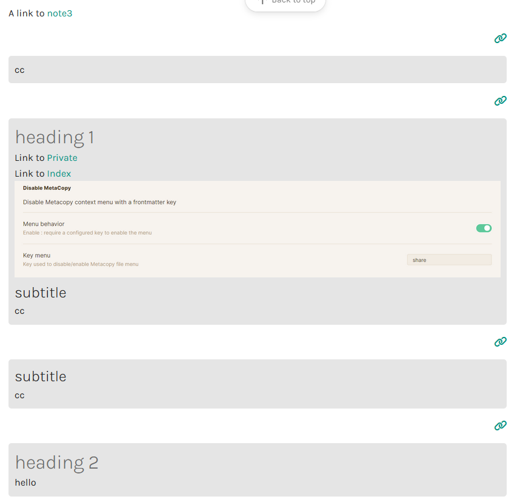
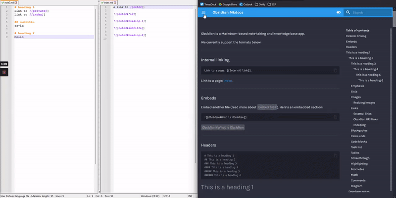

# Embed File
A way to embed a file present in your docs.
Support both wikilinks & normal links.
Intended to be used by obsidian user.




# Activate the plugin
1. Run `pip install mkdocs-embed-file-plugins`
2. Update your `mkdocs.yml` with :
    ```yaml
    plugins:
      - search
      - embed_file 
    ```
3. [Override](https://www.mkdocs.org/user-guide/customizing-your-theme/) your `main.html` with :
    ```html
    
    
    
        <link rel="stylesheet" href="https://cdn.jsdelivr.net/npm/@fortawesome/fontawesome-free@5.15.4/css/fontawesome.min.css" integrity="sha384-jLKHWM3JRmfMU0A5x5AkjWkw/EYfGUAGagvnfryNV3F9VqM98XiIH7VBGVoxVSc7" crossorigin="anonymous">
   
    ```

# Usage

| Usage               | wikilinks                | markdown links           |
|---------------------|--------------------------|--------------------------|
| cite a entire file  | `![[filename]] `         | ` `         |
| Cite a heading part | `![[filename#heading]] ` | ``  |
| Cite a block        | `![[filename#^blockid]]` | `` |

# CSS

The plugin will create :
- A link to the original file, with the form of : `<a href="original link" class="link_citation"><i class='fas fa-link'></i></a>`
- A div with the founded content : `<div class="citation">content founded</div>`
- In case of the link / contents is not found the following block is created instead :
   ```html
   <div class='citation'><a class='link_citation'><i class='fas fa-link'></i></a><p style="text-align: center; display: block"><i class="not_found"> link_alt </i> {a configured message}</p></div>
   ```      
  The message for the not found file can be customized in `mkdocs.yml`. The default message is `file not exists`.

You can add a css in your `docs/assets/css` (or whatever the path is), and add it to your `mkdocs.yml` :
```yml 
extra_css:
    - assets/css/embed_link.css
```
You can find an example of custom css in [docs](docs/embed_link.css)

# Configuration
If you want, you can add compatibility with : 
- [mkdocs callouts](https://github.com/sondregronas/mkdocs-callouts)
- [mkdocs custom tags attributes](https://github.com/Mara-Li/mkdocs-custom-tags-attributes)

To do that, adjust your `mkdocs.yml`
```yaml
markdown_extensions:
   - attr_list
   - nl2br
   - admonition
   - pymdownx.details
plugins:
   - search
   - callouts
   - custom-attributes:
        file: 'assets/css/custom_attributes.css'
   - embed_file:
        callouts: true
        custom-attribute: 'assets/css/custom_attributes.css' //need to be the same as in the config!
        language_message: 'file not exists.'
```

Note : Every extension set in `markdown_extensions` will be used for the converting, so you can use any extension you want.

# Limitation
- The embed file don't use plugin you would use.
- Wikilinks ambiguity are not supported : the first file with the name are used.

# Credit
Thanks to [midnightprioriem](https://github.com/midnightprioriem/mkdocs-tooltipster-links-plugin) for the tooltip plugin. 
